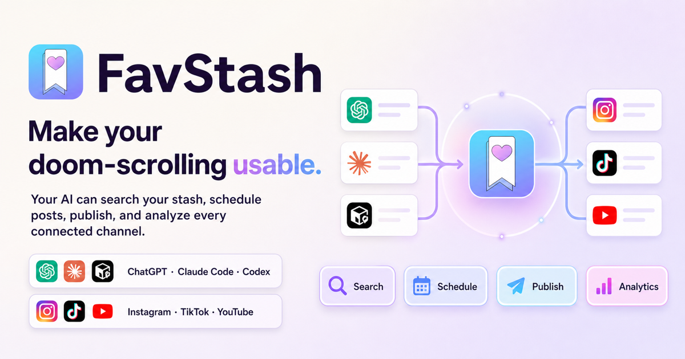

**Give this prompt to your AI agent:**

```text
Set up FavStash for my short-form content workflow.
Clone https://github.com/alisadiq-ai/favstash-ai-video-editing-skills and follow:
https://raw.githubusercontent.com/alisadiq-ai/favstash-ai-video-editing-skills/main/INSTALL_FOR_AGENTS.md

Install the three editing skills and required local media tools in my workspace.
Check whether FavStash MCP is already connected and usable. If it isn't,
guide me through the right connection and sign-in steps for my agent.
Verify the setup, then tell me how to start my first reel.
```

# FavStash — AI Video Editing Skills for Codex & Claude Code

[](https://www.favstash.app/)

**Make your doom-scrolling usable. Save inspiration, create with your AI, review
your content and bring the results into your next plan.**

**Edit Instagram Reels, TikTok videos and YouTube Shorts with Codex, Claude Code
or another skills-aware AI agent.** Start with your footage, a brief or a saved
reference. Let the agent shape the cut, add readable captions, build useful motion
graphics and prepare a reviewed video export.

FavStash Short-Form Skills gives your agent **one adaptive editing workflow and
two optional capabilities**. Talking head, B-roll, split screen and screen demos
are choices within an edit. The treatment follows your story and footage.

[Explore FavStash](https://www.favstash.app/) ·
[Install the skills](#install-the-ai-video-editing-skills) ·
[Try an editing prompt](#short-form-video-editing-examples)

## What you can create

Use this pack for creator content, founder-led videos, product demonstrations,
educational shorts and personal stories. It guides an agent through practical
short-form video editing, from raw takes to a local candidate you can review.

| Starting material | What the agent helps you make |
| --- | --- |
| Talking-head footage | A clear speaker-led cut with natural delivery, useful pauses and supporting visuals |
| B-roll and an idea | A text-over-video reel with action-matched footage and enough time to read each line |
| Product or screen recordings | A vertical demo with legible UI, focused crops and visible results |
| Speaker plus supporting footage | An adaptive split-screen edit that expands the proof when details need space |
| A comparison, process or statistic | An animated diagram, kinetic typography sequence or motion-graphics insert |
| Spoken footage or existing subtitles | Corrected captions with phrase timing, line breaks and phone-readable placement |

The workflow includes safe areas for platform controls, voice-led sound design,
reference analysis, numbered revisions and review of the encoded output. You keep
the source files and editable project where the chosen editor supports them.

## Three skills, one adaptive workflow

| Skill | When to use it |
| --- | --- |
| [favstash-shortform](skills/favstash-shortform/SKILL.md) | End-to-end edits and revisions: choose layouts, prepare footage, handle ordinary captions and sound, check safe areas and review the export |
| [motion-graphics-short](skills/motion-graphics-short/SKILL.md) | Add animated explanations, graphic inserts, data reveals or kinetic type when movement helps communicate |
| [shortform-captions](skills/shortform-captions/SKILL.md) | Work in depth on transcription, subtitle timing, translations, caption styling or revisions |

Start with `favstash-shortform`. Add a specialist when the material needs it.
There is no mandatory style picker, planning schema or setup interview, and the
guidance adapts to your brand instead of imposing a fixed visual template.

## Install the AI video editing skills

Paste the prompt above into Codex, Claude Code, Cursor or another local coding
agent. Your agent follows [INSTALL_FOR_AGENTS.md](INSTALL_FOR_AGENTS.md) to:

1. Clone this repository into your creator workspace and install the three skills
   for the agent you are using.
2. Check existing tools and install missing dependencies: Node.js 22+, FFmpeg,
   FFprobe, yt-dlp and the local HyperFrames runtime.
3. Verify rendering, then check whether FavStash MCP can make an authenticated
   read-only request. If needed, guide you through connection and sign-in.
4. Report what is ready and give you a prompt for your first reel.

You handle account sign-in when required; the agent handles the local setup.
A hosted chat without local file and command access can guide setup, but needs a
local agent to run the editing tools. You can start editing while a FavStash
connection is pending, or choose local editing only.

<details>
<summary>Prefer to install the skills yourself?</summary>

From your creator workspace:

```bash
npx skills add https://github.com/alisadiq-ai/favstash-ai-video-editing-skills
```

For just the adaptive editor, add `--skill favstash-shortform`. From a local
checkout, use `npx skills add .`. These commands install skills; the
[agent setup guide](INSTALL_FOR_AGENTS.md) covers media dependencies and MCP
verification. See the [Agent Skills CLI](https://github.com/vercel-labs/skills)
for supported clients and options.

</details>

## Short-form video editing examples

Give the agent your actual files, the intended audience and any approved copy or
reference. Mention the platform, duration or tone when those choices matter.

### Edit an Instagram Reel from talking-head footage

```text
Use $favstash-shortform to turn these takes and supporting clips into a
30-second Instagram Reel. Keep my delivery natural, preserve the approved
wording and choose when to show me, split screen or full-screen proof.
Add readable captions and show me the reviewed export.
```

### Make a TikTok or YouTube Short from B-roll

```text
Use $favstash-shortform to make a 20-second vertical video from this idea
and my B-roll folder. Match the action to the copy, keep the text readable
on a phone and use sound effects only where they support a visible event.
```

### Add motion graphics to a product demo

```text
Use $motion-graphics-short to explain this before-and-after comparison
inside my current edit. Match its fonts and colors, use the supplied
numbers and keep the actual product recording as the proof.
```

### Fix captions without rebuilding the video

```text
Use $shortform-captions to correct the names, timing and line breaks in
this short. Keep captions clear of my face and platform controls.
Preserve the approved cut and deliver the corrected subtitle data too.
```

## Connect FavStash: social media for AI agents

This pack handles editing. [FavStash](https://www.favstash.app/) adds the surrounding
creator workflow: an AI content planner, AI social media scheduler and social
media management tool that connects saved inspiration, a content calendar,
publishing and performance feedback.

- **Save and find inspiration.** Search saved Instagram posts, organize saved
  reels into collections and keep notes on the hooks you want to revisit.
  Semantic search helps find ideas by meaning; transcripts and summaries provide
  context for a new brief.
- **Plan content.** Turn selected inspirations into original ideas and a content
  calendar for Instagram, TikTok, YouTube or LinkedIn.
- **Schedule after review.** Prepare posts for connected accounts, with the exact
  export, caption, destination and timing approved before publication.
- **Learn from results.** Use FavStash as a social media analytics tool to inspect
  available reach, views, watch time and follower metrics, then test a specific
  improvement in the next edit.

The connection uses FavStash's **social media MCP server**. MCP, the Model Context
Protocol, lets a compatible agent access connected tools. Installing these
editing skills alone does not connect your stash or social accounts.

Use the [FavStash AI connection guide](https://www.favstash.app/docs/ai-connect)
to connect your agent. The pack also includes brief
[connection and approval guidance](skills/favstash-shortform/references/favstash.md).

### A Claude Code social media workflow

With FavStash connected, start from inspiration you deliberately saved:

```text
Find the product-launch hooks in my FavStash and suggest three directions
for this footage. Use $favstash-shortform to edit the direction I select.
Prepare a caption and calendar draft for review before scheduling.
```

### A Codex social media workflow

With connected-account analytics available, use evidence to guide a revision:

```text
Compare the available watch-time metrics for my recent shorts at similar
ages. Suggest one opening to test, then use $favstash-shortform to make
that revision from my source project. Keep the previous export.
```

## Local tools, captions and sound design

Use your existing editor and project when they work. The optional helpers live
inside the main skill, so it remains useful when installed alone.

| Tool or resource | Purpose |
| --- | --- |
| Node.js 22+ | Run the bundled project and media helpers |
| FFmpeg and FFprobe | Prepare media, inspect streams and check encoded-file integrity |
| HyperFrames | Render a coded visual composition when the edit needs one; optional setup prepares a pinned runtime |
| yt-dlp | Obtain an authorized reference-analysis copy when working from a URL |
| Original SFX pack | Select subtle clicks, pops, whooshes and other accents for meaningful visual events |

See [local tool setup](skills/favstash-shortform/references/local-tools.md) for
commands. You can create a fresh edit folder without installing a renderer:

```bash
npm run new-edit -- --workspace /path/to/creator-project --slug product-demo
```

Keep footage, prepared assets, editable source, previews, numbered exports and
review notes together. Review the actual video at phone size, check complete
caption bounds and listen to the final mix when playback is available.

## Frequently asked questions

### Do I need a FavStash account to edit videos?

No. The skills and local helpers work independently. Connect FavStash when you
want saved inspirations, content planning, scheduling or analytics in the same
workflow. Your AI provider and any external editing services have their own costs.

### Is this a social media scheduling tool?

This repository supplies editing skills. FavStash supplies the connected
publishing service: use it as an Instagram scheduler, TikTok scheduler or YouTube
scheduler, with account-specific settings and approval before posting. LinkedIn
publishing is also available through FavStash. See the
[social media scheduling guide](https://www.favstash.app/docs/scheduling).

### Does FavStash offer a free social media scheduler?

FavStash has a free plan with posting and connected-channel limits. Check the
[current plans](https://www.favstash.app/#pricing) for allowances. This Apache-2.0
skills pack has no separate subscription fee.

### Can I use this in a ChatGPT social media workflow?

ChatGPT can connect to FavStash for stash, planning, publishing and analytics
work. Running this repository's local editing helpers additionally requires an
environment with file access and media tools. Choose the host-specific steps in
the AI connection guide; a hosted connector and a local editing skill serve
different parts of the workflow.

### Can I use a saved reel as a video reference?

Yes, for analysis within your authorized access. Study the hook, pacing, framing
and caption treatment, then create an original edit. Downloaded footage and
music remain analysis-only unless reuse rights are recorded. See
[reference media and rights](skills/favstash-shortform/references/reference-media.md).

### Will the agent automatically publish my finished video?

No. It delivers a local candidate for review. Publishing or scheduling needs
approval for the exact file, caption, account and time. A connected service or
finished render does not authorize posting.

## Testing and contributing

For repository development:

```bash
npm test
npm run validate
```

These checks cover helpers and repository integrity. Real-footage trials and
creative review are still part of testing an editing workflow. Share concrete
examples of timing, framing or caption problems when contributing improvements.

See [contributing](CONTRIBUTING.md) and [security](SECURITY.md). Keep creator media,
credentials and private research out of Git. Code, instructions and original
SFX use [Apache-2.0](LICENSE); external tools retain their own
[licenses](THIRD_PARTY_NOTICES.md).
