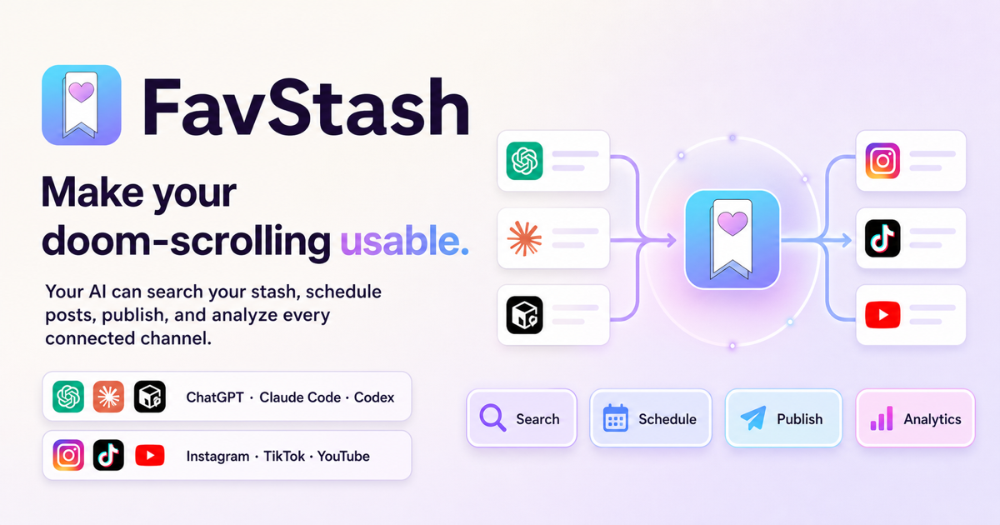
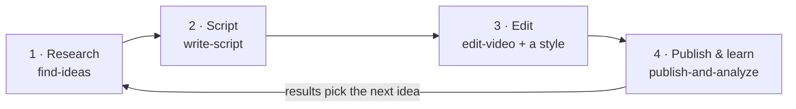
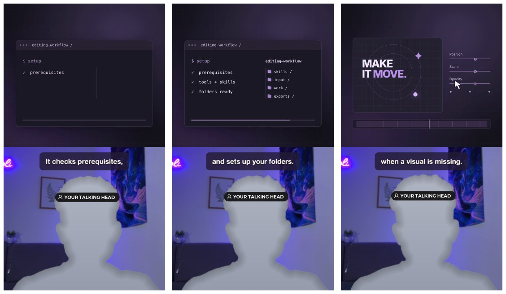
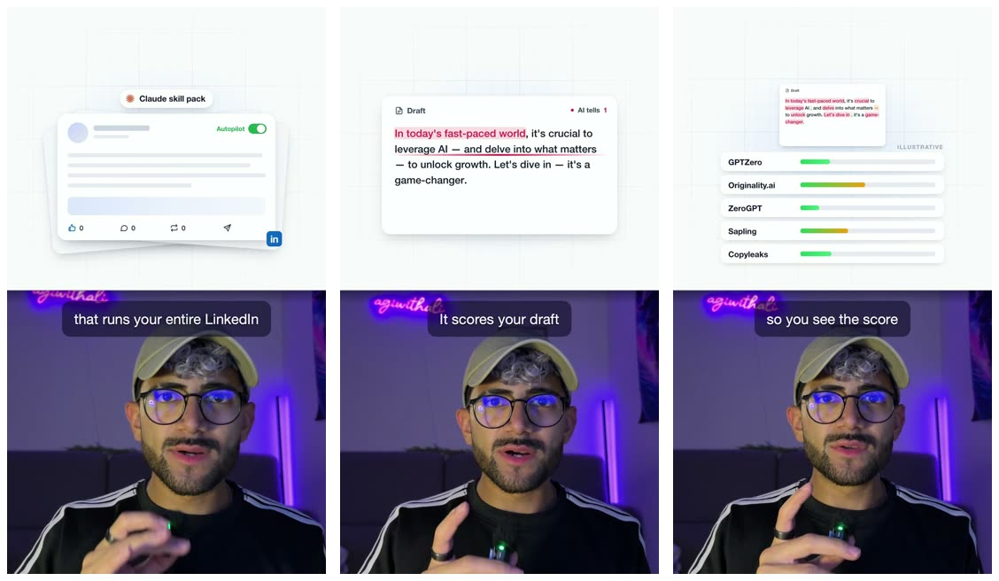
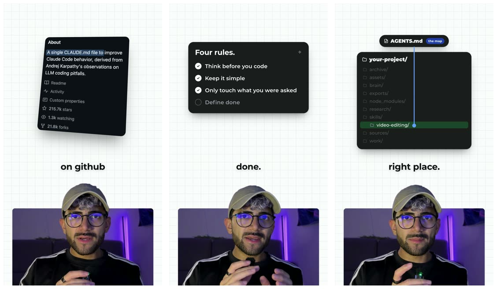
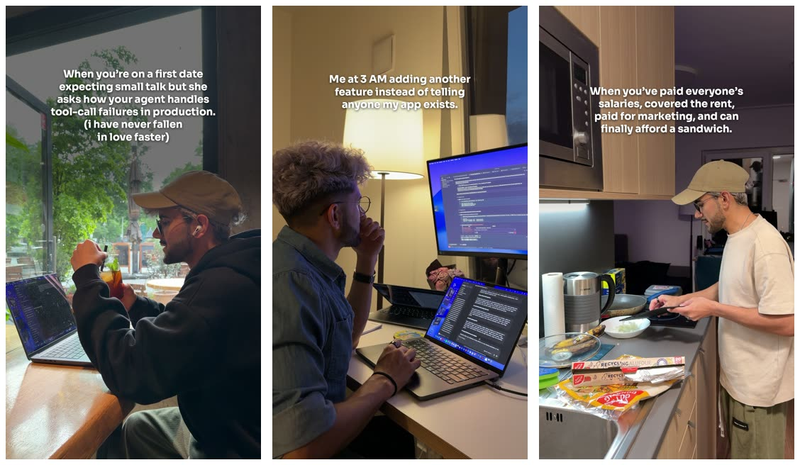

# FavStash Creator Skills: find ideas, script, edit and publish short videos with Claude Code or Codex

[](https://www.favstash.app/)

**Give your AI agent the whole short-form loop.** These free, open-source skills
teach Claude Code, Codex or any skills-aware agent to find proven ideas, write
scroll-stopping scripts in your voice, edit Reels, TikToks and Shorts in four
finished styles, then publish and learn from the results.

**Give this prompt to your agent:**

```text
Set up FavStash creator skills for my short-form workflow.
Clone https://github.com/alisadiq-ai/favstash-ai-video-editing-skills and follow:
https://raw.githubusercontent.com/alisadiq-ai/favstash-ai-video-editing-skills/main/INSTALL_FOR_AGENTS.md

Install all eight skills and the local media tools they need in my workspace.
Check whether FavStash is connected; if not, connect it with the FavStash CLI
(Codex or Claude Code) or guide me through sign-in. Verify the setup, then tell
me how to start my first reel.
```

## The creator loop


```mermaid
flowchart LR
  R[1 · Research<br/>find-ideas] --> S[2 · Script<br/>write-script]
  S --> E[3 · Edit<br/>edit-video + a style]
  E --> P[4 · Publish & learn<br/>publish-and-analyze]
  P -->|results pick the next idea| R
```

| Stage | Skill | What your agent does |
| --- | --- | --- |
| 1 · Research | [find-ideas](skills/1-research/find-ideas/SKILL.md) | Finds proven reels to adapt (3× their creator's median), reads saved inspiration and suggests what to make next |
| 2 · Script | [write-script](skills/2-scripting/write-script/SKILL.md) | Copies the proven hook, adds as many equally aggressive alternatives as you want to test, writes one shared body in your voice and hands over a filmable brief |
| 3 · Edit | [edit-video](skills/3-editing/edit-video/SKILL.md) | Cuts your takes, removes retakes, adds captions, sound and motion graphics, keeps everything in safe areas and reviews the actual export |
| 4 · Publish & learn | [publish-and-analyze](skills/4-publish-and-learn/publish-and-analyze/SKILL.md) | Exports at full quality, picks a real-frame cover, avoids duplicate holds on hook variants, schedules after your approval and compares results |

Every skill works on its own. [FavStash](https://www.favstash.app/) closes the loop:
your saved reels feed research, approved cuts go to Instagram, TikTok, YouTube or
LinkedIn, and the analytics pick the next test.

## Editing styles

`edit-video` is the base for every edit. Add the style that fits the story; each one
lives in its own folder under [`skills/3-editing-styles/`](skills/3-editing-styles).

### [adaptive-glass](skills/3-editing-styles/adaptive-glass/SKILL.md): speaker plus moving proof in glass panels



For product, tool and explainer reels with real screen proof. Palettes are matched to your footage.

### [paper-grid](skills/3-editing-styles/paper-grid/SKILL.md): white grid pane, one animated UI artifact per line



For tool, repo and feature explainers where every sentence names something to show.

### [breakout-card](skills/3-editing-styles/breakout-card/SKILL.md): your head breaks out of a card at the bottom



For talking-head explainers that alternate graphics with personal lines. One-to-two-word captions in Montserrat.

### [text-over-footage](skills/3-editing-styles/text-over-footage/SKILL.md): one readable line over matching B-roll



For jokes, observations and setup/payoff reels, with footage matched to the line.

## Free to use

The skills are free and open source (Apache-2.0). FavStash's free plan includes
unlimited saved items and stash searches, 100 transcript and AI enrichments, one
connected channel and 10 posts a month. See the [current plans](https://www.favstash.app/#pricing).

## Install

Paste the prompt above into Claude Code, Codex, Cursor or another local coding agent.
It follows [INSTALL_FOR_AGENTS.md](INSTALL_FOR_AGENTS.md) to install the skills,
prepare FFmpeg, HyperFrames and GSAP in your workspace, render a smoke test and
connect FavStash. You only sign in; the agent does the rest.

<details>
<summary>Install the skills yourself</summary>

```bash
npx skills add https://github.com/alisadiq-ai/favstash-ai-video-editing-skills
```

Add `--skill edit-video --skill paper-grid` (for example) to pick skills. The
[agent setup guide](INSTALL_FOR_AGENTS.md) covers media tools and the FavStash connection.

For Claude Code or Codex, the FavStash CLI connects your stash and uploads local files:

```bash
npm install -g @sketric/favstash-mcp@latest
favstash auth login
favstash setup --agent claude-code
favstash doctor
```

Use `--agent codex` for Codex. Other agents connect through FavStash's MCP server
with OAuth ([connection guide](https://www.favstash.app/docs/ai-connect)).

</details>

## Try it

```text
Use $find-ideas to find three proven reels about AI coding tools I could adapt.
```

```text
Use $write-script to adapt this reel into a few hooks to test and one body in my voice.
```

```text
Use $edit-video with $breakout-card to edit these takes into a 40-second reel.
```

```text
Use $publish-and-analyze to prepare covers and a caption for this cut, then compare
last week's hook test once I approve.
```

## FAQ

**Do I need FavStash?** No. Research, scripting and editing work without it. FavStash
adds your saved inspiration, scheduling and analytics so the loop closes.

**Will my agent post without asking?** No. It delivers a local cut. Posting needs your
approval for the exact file, cover, caption, account and time.

**What runs where?** Editing runs locally with FFmpeg and HyperFrames (Node 22+).
`paper-grid`, `breakout-card` and the duplicate check also use Python. The
breakout card's built-in person matte uses Apple Vision on macOS; on other systems,
supply a matte from any segmentation tool.

**Can I use a saved reel as a reference?** Yes, for analysis. Adapt its hook,
structure and pacing, and make the video from your own footage. Downloaded footage
and music stay analysis-only unless you have reuse rights.

## Contributing

```bash
npm test
npm run validate
```

See [contributing](CONTRIBUTING.md) and [security](SECURITY.md). Code, instructions
and original SFX use [Apache-2.0](LICENSE); external tools and the bundled Montserrat
font keep their own [licenses](THIRD_PARTY_NOTICES.md). The style previews use the
maintainer's own footage.
